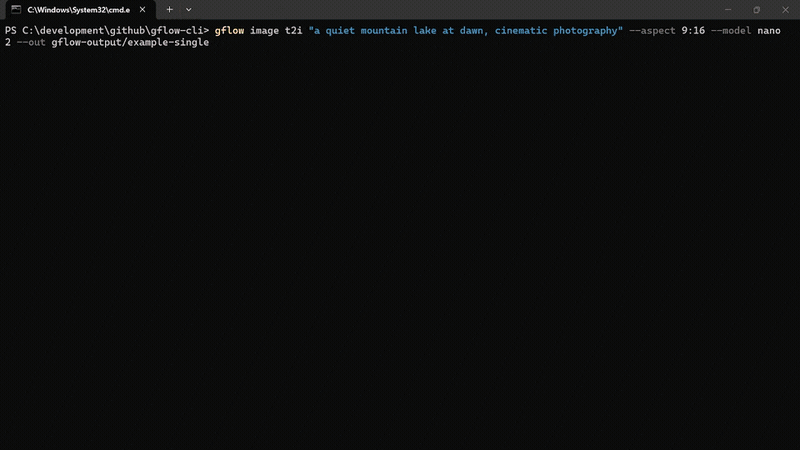

# gflow-cli

> **Unofficial Python CLI for Google Flow.** Drive [Veo](https://labs.google/fx/tools/flow) (image-to-video, text-to-video) and Imagen (text-to-image) generations from your terminal — scripted, batched, pipeline-friendly.

[](https://pypi.org/project/gflow-cli/)
[](https://github.com/ffroliva/gflow-cli/actions/workflows/ci.yml)
[](https://github.com/ffroliva/gflow-cli/actions/workflows/release.yml)
[](https://pypi.org/project/gflow-cli/)
[](LICENSE)
[](docs/PROJECT_STATUS.md)
[](https://github.com/astral-sh/ruff)
[](https://github.com/microsoft/pyright)
[](CONTRIBUTING.md)
[](https://sonarcloud.io/summary/new_code?id=ffroliva_gflow-cli)

> ⚠️ **Unofficial. Reverse-engineered. Not affiliated with Google.** Endpoints can change at any time. Full [DISCLAIMER](DISCLAIMER.md).
>
> 🌐 **Headed-browser today.** gflow drives Flow via a persistent Playwright Chromium profile — Google's auth + reCAPTCHA gates currently require it. See [Architecture & current limitations](#architecture--current-limitations) for the contributor opportunity.

## Why gflow-cli?

For Google AI Ultra / Pro subscribers with Veo credits and batch workloads:

- **Burn credits efficiently** — `for p in $(cat prompts.txt); do gflow image t2i "$p"; done` _(image batching, plus `gflow video t2v`/`i2v`/`r2v`, all ship today)_
- **Build pipelines** — wire Veo into your content automation, AI video stack, or batch experiments
- **Stay in the terminal** — no Chromium UI, no clicking through dialogs (after a one-time `gflow auth login`)

Same Veo + Imagen models, same quality, same Ultra/Pro billing — programmatic.

## 60-second quick start

```bash
# 1 · Install (uv recommended — also: pip install gflow-cli)
uv tool install gflow-cli
uv tool run --from gflow-cli playwright install chromium     # one-time, ~150 MB

# 2 · Authenticate (one-time, opens a real Chrome window)
gflow auth login --browser chrome

# 3 · Generate
gflow image t2i "a hot air balloon over Tokyo at sunrise"
# or:
gflow video t2v "Slow cinematic push-in on a sunlit forest clearing" --aspect 16:9
```

Outputs land under `./out/` (or `$GFLOW_CLI_OUTPUT_DIR`). First call is ~30–90 s while Chromium warms; subsequent calls reuse the warm session.

> **Why `--browser chrome`?** Google rejects Playwright's bundled Chromium. The CLI fails fast with a friendly error (`AuthBrowserRejectedError`, exit code 14) if you pick anything else.

## In-depth quick start

See **[USER_GUIDE — Journey 1: First-time setup](docs/USER_GUIDE.md#journey-1--first-time-setup-10-minutes)** for the 10-minute walkthrough with troubleshooting, multi-account setup, and the structured-log primer.

## Demo



*A single `gflow image t2i "..." --aspect 9:16 --model nano2` call against a logged-in Pro/Ultra profile. Terminal shows the streaming `structlog` JSON for the run, the final `ls` of the written PNG, and nothing else — Chromium drives the Flow editor silently in the background.*

Reproduce the recording: [`scripts/record_demo.ps1`](scripts/record_demo.ps1) (Windows + OBS + ffmpeg + gifski).

## Documentation

[**docs/INDEX.md**](docs/INDEX.md) is the master routing layer. Quick links:

| Topic | Read |
|---|---|
| 🎯 **Getting started** | [User Guide](docs/USER_GUIDE.md) · [Usage](docs/USAGE.md) · [Configuration](docs/CONFIGURATION.md) |
| 🔐 **Auth & sessions** | [Authentication](docs/AUTHENTICATION.md) · [Known issues](KNOWN_ISSUES.md) |
| 🏗️ **Internals** | [Architecture](docs/ARCHITECTURE.md) · [Security](docs/SECURITY.md) · [Debugging](docs/DEBUGGING.md) |
| 📦 **Releases** | [Changelog](CHANGELOG.md) · [Roadmap](ROADMAP.md) · [Release protocol](RELEASE.md) · [Project status](docs/PROJECT_STATUS.md) |
| 🤝 **Contributing** | [Contributing](CONTRIBUTING.md) · [Development](docs/DEVELOPMENT.md) · [GitHub workflow](docs/GITHUB.md) |

## For AI agents & LLMs

gflow-cli ships three agent entry points — pick the one your tool reads first.

| File | Audience | Tools |
|---|---|---|
| [**AGENTS.md**](AGENTS.md) | Universal coding-agent spec | Cursor · Codex · Aider · Gemini CLI · Jules · Devin · Windsurf · Zed · Warp · opencode · Copilot · 60k+ repos |
| [**CLAUDE.md**](CLAUDE.md) | Claude Code's auto-loaded memory | Claude Code |
| [**llms.txt**](llms.txt) | LLM-readable summary (llmstxt.org format) | Paste into ChatGPT / Claude / Gemini to onboard the model |
| [`skills/gflow-cli/SKILL.md`](skills/gflow-cli/SKILL.md) | Claude Code Skill | Symlink into `~/.claude/skills/` |

**Onboarding any agent in one line:** paste this into your agent of choice —

> *"Read [AGENTS.md](https://github.com/ffroliva/gflow-cli/blob/main/AGENTS.md) and [docs/INDEX.md](https://github.com/ffroliva/gflow-cli/blob/main/docs/INDEX.md), then help me with my Flow batch."*

## Architecture & current limitations

```text
gflow CLI  →  Provider (interchangeable)  →  Flow (ui_automation) / Mock (tests) / [planned: Official Veo]
                                              ↓
                                      Playwright Chromium (headed login, headless after)
                                              ↓
                              aisandbox-pa.googleapis.com  (Google's private Flow API)
```

**Current transport:** `ui_automation` — drives Flow via a persistent Playwright Chromium profile. Production-stable, end-to-end verified per release (see [LIVE_VERIFICATION_*](docs/) per-release evidence files).

**What's blocked:** A pure HTTP transport for video generation. The video upload endpoint returns HTTP 401 under non-Chrome browsers + a reCAPTCHA mint we cannot reproduce headlessly. Three earlier HTTP strategies (`evaluate_fetch` / `bearer` / `sapisidhash`) are named in the codebase history; the actual transport modules have not yet been extracted into a subpackage.

**How you can help:** If you have successfully driven `aisandbox-pa.googleapis.com` from outside a real Chrome session — or have insight into Google's anti-bot stack here — please open an issue. A working REST transport would unlock serverless deployments, true horizontal concurrency, and roughly 10× the project's reach. Details: [docs/ARCHITECTURE.md § Headed-browser dependency](docs/ARCHITECTURE.md#headed-browser-dependency--current-limitation).

## Project status

**v0.9.0 — alpha (latest on PyPI).** Image (T2I / I2I / upload) + Video T2V / I2V / R2V live end-to-end on `ui_automation`, with a video `--model` picker (5 Veo models) + `--duration` / `--count`. New in v0.9.0: `gflow data list {projects,images,videos,profiles}` read CLI over the local SQLite catalog, `ROADMAP.md`, sponsorship wiring, and locale-agnostic media-dialog selectors. Only video `batch` (manifest runner) is still queued for Phase B — use a shell for-loop until then ([USAGE](docs/USAGE.md#gflow-video-batch)). Full milestone history → [docs/PROJECT_STATUS.md](docs/PROJECT_STATUS.md). Changelog → [CHANGELOG.md](CHANGELOG.md). Where the project is heading → [ROADMAP.md](ROADMAP.md).

## License & legal

[MIT License](LICENSE) © 2026 Flavio Oliva (`ffroliva`). The MIT license covers `gflow-cli`'s code only — it does not grant rights to Flow, Veo model output, or any Google service. Google's own terms (Labs Additional Terms, Ultra/Pro subscription terms) govern your generations. See [DISCLAIMER](DISCLAIMER.md).

## Acknowledgements

- [`edge-tts`](https://github.com/rany2/edge-tts) — design inspiration for community SDKs over private cloud APIs.
- [`googleapis/python-genai`](https://github.com/googleapis/python-genai) — the official Veo SDK that a future provider release may alias.
- [Keysight — *Google Labs – Flow AI with Veo3: A Network Traffic Analysis*](https://www.keysight.com/blogs/en/tech/nwvs/2025/08/04/google-flow-ai-har-analysis) — independent capture that helped validate the captured route patterns.

---

## Stats

[](https://github.com/ffroliva/gflow-cli/stargazers)
[](https://github.com/ffroliva/gflow-cli/network/members)
[](https://github.com/ffroliva/gflow-cli/watchers)
[](https://github.com/ffroliva/gflow-cli/issues)
[](https://github.com/ffroliva/gflow-cli/pulls)
[](https://github.com/ffroliva/gflow-cli/commits/main)
[](https://github.com/ffroliva/gflow-cli)
[](https://pypi.org/project/gflow-cli/)

If `gflow-cli` saves you time, please ⭐ the repo — it is the cheapest way to support the project.
