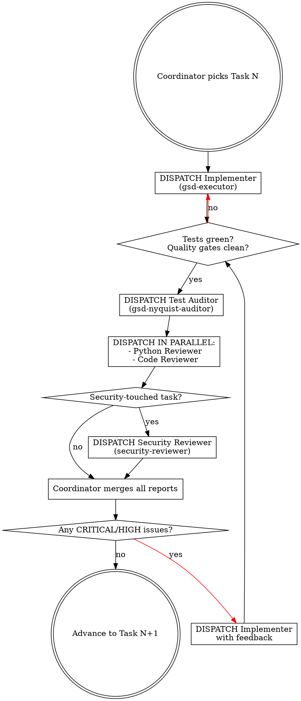

# Video MVP — Multi-Agent Orchestration Plan

> **For agentic workers:** REQUIRED SUB-SKILL: Use superpowers:dispatching-parallel-agents (for parallel reviewers) and superpowers:subagent-driven-development (for sequential implementer dispatch). The Coordinator (the main session) owns plan progress, dispatches sub-agents, and makes go/no-go calls between tasks.
>
> **Companion doc:** [`2026-05-09-video-mvp.md`](2026-05-09-video-mvp.md) — the 13-task implementation plan that this orchestration executes.

**Goal:** Define WHO does WHAT, WHY, WHO CALLS WHOM, and WHEN — so the Video MVP plan ships with built-in test/code/security review gates instead of "Implementer commits and we hope it's right."

**Architecture:** Coordinator-led, single human-in-the-loop, multiple specialist sub-agents per task. Each task moves through Implement → Audit → Review → Approve gates. Reviewers run in parallel where possible. The Coordinator never implements code itself — it only orchestrates and decides.

**Tech Stack:** Claude Code subagents (`gsd-*` and `everything-claude-code:*` from this user's installed plugins).

---

## 1. Roles

Each role is mapped to a real, available subagent type in this environment.

| Role | Subagent (`subagent_type`) | Purpose | Reads | Writes |
|---|---|---|---|---|
| **Coordinator** | (none — the main session) | Owns plan progress; dispatches; merges findings; decides go/no-go | All plan docs + sub-agent reports | Commit messages, status updates to user |
| **Implementer** | `gsd-executor` | Executes ONE task verbatim from the plan: writes failing test → impl → green tests → commits | Task spec from `2026-05-09-video-mvp.md` | Code + tests + one git commit |
| **Test Auditor** | `gsd-nyquist-auditor` | Verifies the new tests actually exercise the contract claimed by the task. Looks for "tests that pass without testing anything." | Diff + spec for the just-completed task | Audit report (PASS/FAIL + gaps) |
| **Python Reviewer** | `everything-claude-code:python-reviewer` | PEP 8, type hints, Python idioms, performance, security at the language level | Diff | Review report (CRITICAL/HIGH/MEDIUM/LOW findings) |
| **Code Reviewer** | `everything-claude-code:code-reviewer` | Quality, maintainability, naming, decomposition, README/docstring accuracy. Catches what Python Reviewer doesn't. | Diff + spec | Review report |
| **Security Reviewer** | `everything-claude-code:security-reviewer` | Auth, secret leakage, injection, request signing, SSRF, OWASP top 10. Only invoked for security-touched tasks. | Diff + spec | Security report |
| **Build Resolver** | `everything-claude-code:build-error-resolver` | Only invoked if CI fails. Minimal, surgical fixes to get builds green. | CI failure logs | Patch + commit |
| **Verifier** | `gsd-verifier` | At Phase end: verifies the codebase delivers what the phase promised. Reads goals + samples + diffs the actual code. | Phase exit criteria + repo state | `VERIFICATION.md` |

The Coordinator is the **only** role that talks to the user.

---

## 2. Per-task workflow

The same flow runs for every task in the implementation plan. The Coordinator drives.



### Stage-by-stage detail

#### Stage A — Implementer dispatch (Coordinator → Implementer)

**Coordinator action:** spawns a fresh `gsd-executor` subagent with:
- The exact task block from `2026-05-09-video-mvp.md` (steps 1.x through 1.6 for Task 1, etc.)
- A reminder of the project's quality gates (ruff/format/pyright/pytest)
- A reminder of `CLAUDE.md` rules (no AI co-author, frozen domain layer, no `print()`, etc.)

**Implementer SHALL:**
1. Read the task in full before doing anything.
2. Execute every numbered step in order.
3. Run all four quality gates locally.
4. Commit using the message in the task's commit step.
5. Return: `(commit SHA, diff stat, gate output)`.

**Implementer SHALL NOT:**
- Touch any file outside the task's "Files" list.
- Skip a step.
- Reorder TDD: tests come first, always.
- Add `Co-Authored-By: Claude` to the commit.

#### Stage B — Implementer-completion gate (Coordinator)

The Coordinator inspects the Implementer's report:

- ✅ All four gates green AND commit landed → proceed to Stage C.
- ❌ Any gate red OR no commit → re-dispatch Implementer with the failure context. Cap at 3 iterations; on the 3rd failure, escalate to user.

#### Stage C — Test Auditor dispatch (Coordinator → Test Auditor)

**Coordinator action:** spawns `gsd-nyquist-auditor` with:
- The task spec
- The diff of files added/modified by the Implementer
- The commit SHA

**Test Auditor SHALL:**
1. Read the task's "Step 1.1: Write the failing test" code blocks — those are the contract.
2. Compare against the actual tests in the diff.
3. Verify each acceptance criterion in the spec has a test that fails when the implementation is removed.
4. Run the tests with the implementation file deleted/stubbed — they MUST fail (mutation-test lite).
5. Return: `PASS` or `FAIL [list of gaps]`.

#### Stage D — Reviewer dispatch (Coordinator → Python Reviewer + Code Reviewer in PARALLEL)

**Coordinator action:** uses `superpowers:dispatching-parallel-agents` to spawn both reviewers in a single message:

```python
# Pseudocode — actual is dispatched as parallel Task tool calls
parallel_dispatch([
    Task(subagent_type="everything-claude-code:python-reviewer",
         prompt=f"Review diff for task {N}. Spec: {task_spec}. Diff: {diff}"),
    Task(subagent_type="everything-claude-code:code-reviewer",
         prompt=f"Review diff for task {N}. Spec: {task_spec}. Diff: {diff}"),
])
```

**Each Reviewer SHALL** return a structured report:

```text
CRITICAL:
  - <finding> at <file>:<line> — <why> — <suggested fix>
HIGH:
  - ...
MEDIUM:
  - ...
LOW:
  - ...
```

#### Stage E — Security Reviewer (conditional)

**Triggers:** Coordinator dispatches Security Reviewer for tasks that touch:
- Auth / sessions / cookies (Task 2, Task 3 — reCAPTCHA)
- Network calls / new endpoints (Task 4, Task 11)
- Secret/token handling (Task 4, Task 6)
- File I/O on user-controlled paths (Task 5, Task 11)

For the Video MVP plan: **Tasks 2, 3, 4, 5, 6, 11** are security-touched.
**Tasks 1, 7, 8, 9, 10, 12, 13** are NOT (pure refactors, type definitions, doc updates, version bumps).

#### Stage F — Coordinator merge + decide

**Coordinator action:** collates all reports:

| Decision | Action |
|---|---|
| All reports clean (no CRITICAL or HIGH) | Advance to Task N+1 |
| 1+ CRITICAL or HIGH | Re-dispatch Implementer with the consolidated findings. Re-loop from Stage A. |
| Test Auditor failed | Re-dispatch Implementer with the gaps. |
| All MEDIUM/LOW only | Advance, log findings to `KNOWN_ISSUES.md` if non-blocking |

#### Stage G — Phase verifier (after all tasks)

**Coordinator action:** after Task 13 commits, dispatches `gsd-verifier` with:
- The Phase 2 Definition of Done (8 checkboxes from the implementation plan)
- The current repo state (HEAD)
- Reference samples and CHANGELOG

**Verifier SHALL** produce `docs/superpowers/plans/VERIFICATION-2026-05-09-video-mvp.md` with each criterion marked PASS / FAIL / PARTIAL + evidence.

---

## 3. Task → agent matrix

For every task in `2026-05-09-video-mvp.md`, the agents involved + their estimated wall-clock + whether security review fires.

| Task | Implementer | Test Auditor | Python Reviewer | Code Reviewer | Security Reviewer | ETA |
|---|---|---|---|---|---|---|
| **1.** Video value objects + body builder | gsd-executor | nyquist-auditor | python-reviewer | code-reviewer | — | 25m |
| **2.** reCAPTCHA site-key discovery | gsd-executor | nyquist-auditor | python-reviewer | code-reviewer | **security-reviewer** | 25m |
| **3.** reCAPTCHA token mint | gsd-executor | nyquist-auditor | python-reviewer | code-reviewer | **security-reviewer** | 25m |
| **4.** `FlowApiClient.generate_video()` | gsd-executor | nyquist-auditor | python-reviewer | code-reviewer | **security-reviewer** | 35m |
| **5.** TSV manifest parser | gsd-executor | nyquist-auditor | python-reviewer | code-reviewer | **security-reviewer** (path traversal) | 25m |
| **6.** `FLOW_CLI_HEADLESS` setting | gsd-executor | nyquist-auditor | python-reviewer | code-reviewer | **security-reviewer** (env handling) | 15m |
| **7.** `gflow video t2v` CLI | gsd-executor | nyquist-auditor | python-reviewer | code-reviewer | — | 35m |
| **8.** `gflow video i2v` CLI | gsd-executor | nyquist-auditor | python-reviewer | code-reviewer | — | 25m |
| **9.** `gflow video batch` CLI | gsd-executor | nyquist-auditor | python-reviewer | code-reviewer | — | 30m |
| **10.** Remove legacy providers/ + models.py | gsd-executor | nyquist-auditor | — | code-reviewer | — | 20m |
| **11.** `scripts/smoke_e2e.py` | gsd-executor | (no auditor — script, not lib) | python-reviewer | code-reviewer | **security-reviewer** | 20m |
| **12.** Docs updates | gsd-executor | (no auditor) | — | code-reviewer | — | 25m |
| **13.** Tag `v0.2.0a1` | gsd-executor | (no auditor) | — | code-reviewer | — | 15m |

**Totals:**
- 13 implementer dispatches
- 11 test audits
- 11 python reviews
- 13 code reviews
- 6 security reviews
- 1 final phase verification

**Wall-clock with parallel reviews:** ~6-7 hours (vs ~12 hours sequential). Reviewers run in parallel; Implementer is sequential because each task may modify the same files.

---

## 4. Sequence diagrams

### Single-task happy path

```text
Coordinator         Implementer       Test Auditor      Reviewers (parallel)
     |                  |                  |                    |
     |--- task spec --->|                  |                    |
     |                  | (writes test)    |                    |
     |                  | (impl)           |                    |
     |                  | (runs gates)     |                    |
     |                  | (commits)        |                    |
     |<--- SHA + diff --|                  |                    |
     |                  |                  |                    |
     |--- spec + diff -------------------->|                    |
     |<--------------------- PASS ---------|                    |
     |                  |                  |                    |
     |---- spec + diff ----------------------------- (parallel) >|
     |<-------------------- clean / clean ---------------------- |
     |                  |                  |                    |
   advance to Task N+1
```

### Re-loop on findings

```text
Coordinator         Implementer       Test Auditor      Reviewers
     |                  |                  |                |
     | (Task N initial) |                  |                |
     |--- spec -------->|                  |                |
     |<-- SHA + diff ---|                  |                |
     |--- spec + diff -------------------->|                |
     |<------------ FAIL [test gap A] -----|                |
     |--- spec + diff ----------------------------- (parallel) >|
     |<-------------- HIGH: missing edge case B -------------- |
     |                  |                  |                |
     | (re-dispatch with A + B)            |                |
     |--- spec + feedback -->|             |                |
     |<-- new SHA + diff ----|             |                |
     | (re-audit + re-review)              |                |
     |<------ PASS / clean ---------------------------------|
   advance
```

---

## 5. The Coordinator's prompt template

Every Implementer dispatch uses this template (the Coordinator fills `<…>`):

```text
You are the Implementer for task <N> of the Video MVP.

CONTEXT:
- Repo: C:/development/github/gflow-cli
- Plan: docs/superpowers/plans/2026-05-09-video-mvp.md
- Read CLAUDE.md before any code change.
- Project rules (CRITICAL invariants):
  * Never add `Co-Authored-By: Claude` to a commit
  * Frozen-domain rule: src/flow_cli/api/dto.py has no I/O
  * No `print()` in src/ — use logging
  * TDD: tests come first
  * All four quality gates must be green BEFORE you commit

YOUR TASK (verbatim from the plan):
<copy task block from 2026-05-09-video-mvp.md>

OUTPUT (return as a structured report):
1. Commit SHA
2. Files changed (path + lines added/removed)
3. Output of each quality gate (ruff/format/pyright/pytest counts)
4. Any deviation from the plan (and why)
```

Reviewer prompts use the same shape with the role-specific instructions.

---

## 6. Coordinator's checklist (per task)

The Coordinator (main session) runs through this list for every task:

- [ ] **Pre-dispatch** — confirm prerequisites for Task N met (does Task N-1 commit exist? CI green? working tree clean?)
- [ ] **Implementer dispatch** — fresh `gsd-executor` with the verbatim task spec
- [ ] **Implementer return** — verify SHA exists, gates were green, only listed files changed
- [ ] **Test Auditor dispatch** — `gsd-nyquist-auditor` with diff + spec
- [ ] **Test Auditor return** — PASS or list of gaps
- [ ] **Reviewer parallel dispatch** — `python-reviewer` + `code-reviewer` in ONE message
- [ ] **Reviewer returns** — collect both reports
- [ ] **Security check** — if task is in {2,3,4,5,6,11}: dispatch `security-reviewer`
- [ ] **Merge findings** — list every CRITICAL + HIGH across all reports
- [ ] **Decide** — clean → advance | findings → re-dispatch Implementer | stuck after 3 loops → escalate to user
- [ ] **CI check** — `gh run list --limit 1` after push: must be green before next task
- [ ] **Update user** — one-line status: "Task N committed (`<sha>`), N+1 starting"

---

## 7. Escalation rules

The Coordinator escalates to the human user when:

| Trigger | Escalation message format |
|---|---|
| 3rd Implementer failure on the same task | "Task N stuck after 3 attempts. Errors: <…>. Options: (A) skip + log, (B) human inspect, (C) revise plan" |
| Test Auditor flags a spec ambiguity | "Task N spec ambiguous: <gap>. Need clarification before proceeding." |
| Reviewer finds a CRITICAL issue not in scope | "Task N implementation correct, but reviewer flagged out-of-scope CRITICAL: <…>. File a separate issue or fix in this task?" |
| Security Reviewer reports a CVE-class issue | "STOP — security risk: <…>. Awaiting your call before next task." |
| CI red after push | "CI red on commit `<sha>`: <error>. Dispatching build-error-resolver?" |

---

## 8. State tracking

The Coordinator maintains task-level state in this conversation (no separate file). At the start of every Coordinator turn:

```text
[Phase 2 — Video MVP]
Tasks done: 1, 2, 3 ✅ | In progress: 4 (Implementer dispatched at 23:14) | Remaining: 5-13
Latest commit: <sha> | CI: green | Open findings: none
```

This goes at the top of every status update to the user, so they can interrupt at any task boundary.

---

## 9. Why this orchestration vs. the simpler subagent-driven-development?

The standard `superpowers:subagent-driven-development` flow is:

```
Coordinator → Implementer → Coordinator (review diff manually) → next task
```

This orchestration adds:

1. **Test Auditor** — catches "tests that pass without testing." The standard flow trusts the Implementer's tests; we don't.
2. **Two reviewers in parallel** — `python-reviewer` and `code-reviewer` see different things (language vs. project quality). Parallelising costs nothing.
3. **Security gate per task** — for security-touched tasks, the security reviewer is a hard prerequisite, not an afterthought.
4. **Phase verifier at end** — `gsd-verifier` confirms the user-facing goals are actually delivered, not just that "all 13 tasks committed."

Trade-off: ~50% more wall-clock (~6h vs ~4h) for substantially higher quality. For a vitrine repo, that's the right call.

---

## 10. Definition of done (this orchestration)

A task is "done" when ALL are true:

- [ ] Implementer's commit landed
- [ ] All four quality gates green (ruff / format / pyright / pytest)
- [ ] Test Auditor returned PASS
- [ ] Python Reviewer returned no CRITICAL/HIGH
- [ ] Code Reviewer returned no CRITICAL/HIGH
- [ ] Security Reviewer (if applicable) returned no CRITICAL/HIGH
- [ ] CI green on origin/main after push
- [ ] One-line status update sent to user

The phase is "done" when ALL tasks are done AND the Verifier produces `VERIFICATION-2026-05-09-video-mvp.md` with every Phase 2 DoD criterion marked PASS.

---

## Self-review checklist (completed by author)

- [x] Every role mapped to a real subagent_type available in this environment
- [x] Per-task workflow has clear gates with measurable PASS/FAIL criteria
- [x] Parallelism explicitly used where it doesn't cause conflicts (reviewers, never implementers)
- [x] Security review is a TASK-SPECIFIC gate, not a phase-end afterthought
- [x] Escalation rules are explicit so the Coordinator never silently spins
- [x] State tracking is lightweight (in-conversation, no extra file to keep in sync)
- [x] Trade-off vs. simpler flows is documented

---

## Execution handoff

This orchestration plan + the implementation plan together are ready to execute.

**Two execution options for the orchestration itself:**

1. **Coordinator-led now** — I (the main session) start dispatching Task 1 immediately, following the per-task workflow above. Each task generates 4-6 sub-agent dispatches (impl + audit + 2 reviews + maybe security). Status updates between tasks. ETA ~6-7 hours.

2. **Approve plan first, execute later** — You read both plans, approve / tweak the orchestration (e.g. drop a reviewer, change parallelism), and I start in a follow-up session.

Which? (`coordinate now` / `approve first`)
