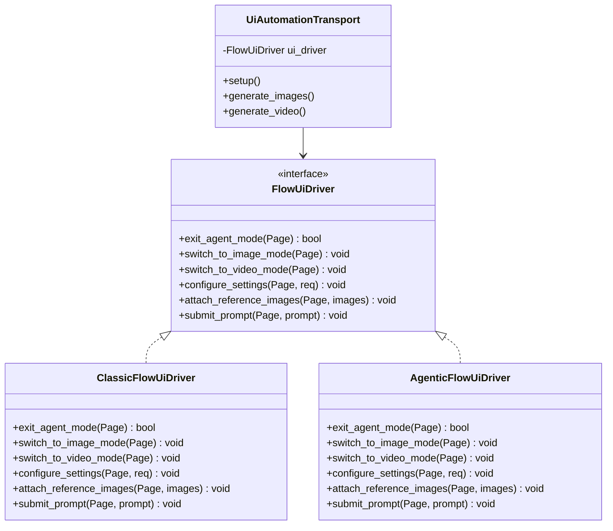

# Design Options: Solving Agentic UI in gflow-cli

This document outlines the architectural and design strategies to handle Google Flow's new Agentic UI cohort across Image Text-to-Image (`t2i`), Image-to-Image (`i2i`), and Image-to-Video (`i2v`) generations in a modular, clean, and maintainable manner.

---

## The Challenge

Google Flow's forced Agentic UI modifies the interface as follows:
- **No media panel:** Inline triggers like `crop_9_16` are removed.
- **New Settings Panel:** Generation settings (model, aspect ratio, duration, upscale) are moved into a settings panel triggered by the `tune` Material Symbol.
- **Conversational Box:** Prompts are input via a Slate.js chat-style box.
- **Different backend request pipeline:** Submissions route through `flowCreationAgent:streamChat?alt=sse` instead of direct generation endpoints.

---

## Strategy 1: Pluggable UI Driver Strategy (Recommended)

Extract DOM interaction logic out of `UiAutomationTransport` and `VideoGenerationMixin` and delegate to a pluggable UI driver strategy.

### Details
- During `setup()`, the transport probes the DOM:
  - If `crop_*` trigger is present $\rightarrow$ Instantiates `ClassicFlowUiDriver`.
  - If agentic indicators (`tune` icon, Spark symbols) are present $\rightarrow$ Instantiates `AgenticFlowUiDriver`.
- Core transport methods call `self.ui_driver.configure_settings(page, request)` rather than hardcoding selectors.

### Pros
- **Strict Separation of Concerns:** Selectors for the two UIs never pollute the same files or code blocks.
- **Easy Maintenance:** Google updates in one interface do not risk breaking or drifting selectors in the other.
- **No Control Flow Pollution:** Eliminates complex `if` conditions in the main transport.

---

## Strategy 2: Component-based Page Object Model (POM)

Break the Flow editor UI down into discrete components, each with layout-specific subclasses.

### Details
- Define component classes:
  - `PromptBox`: Handles prompt entry and submission.
  - `SettingsPanel`: Handles model, aspect ratio, duration, and output count selection.
  - `MediaCatalog`: Handles reference image uploads and attachments.
- Instantiation is conditional:
  - `ClassicSettingsPanel` interacts with the classic aspect dropdown.
  - `AgenticSettingsPanel` clicks the `tune` button and interacts with Radix-popovers.

### Pros
- Granular component testing and isolation.
- Easier to adapt if only a single component (e.g. the Media Catalog) changes in a new Flow A/B test.

### Cons
- High boilerplate; increases class count significantly.

---

## Strategy 3: Detect & Fail Cleanly (Phase 1)

Dynamically detect the A/B cohort at runtime and immediately exit with a specific error and exit code.

### Details
- Use runtime DOM classification. If a forced Agentic UI is detected:
  - Raise `FlowAgentUiError` (exit code 25).
  - Take a diagnostic viewport screenshot (`debug_forced_agent_ui.png`).
  - Provide a clear remediation hint explaining the server-side A/B cohort assignment.

### Pros
- **Immediate UX Fix:** Prevents the CLI from hanging for 30+ seconds and raising vague timeout/drift errors.
- **Safety First:** The experimental Agent UI is highly volatile. Failing cleanly is far safer than driving unstable selectors during active Google A/B testing.
- **Low Implementation Overhead:** Shipped quickly with minimal risk of regressions.

---

## Recommended Sequence

1. **Phase 1 (Immediate):** Implement **Strategy 3 (Detect & Fail Cleanly)**. This establishes the DOM detection rules, maps the exit codes, and resolves the active CLI hang issues.
2. **Phase 2 (Future):** If driving the Agentic UI becomes a priority, refactor the transport layer to adopt **Strategy 1 (Pluggable UI Driver Strategy)** and implement the `AgenticFlowUiDriver`.
