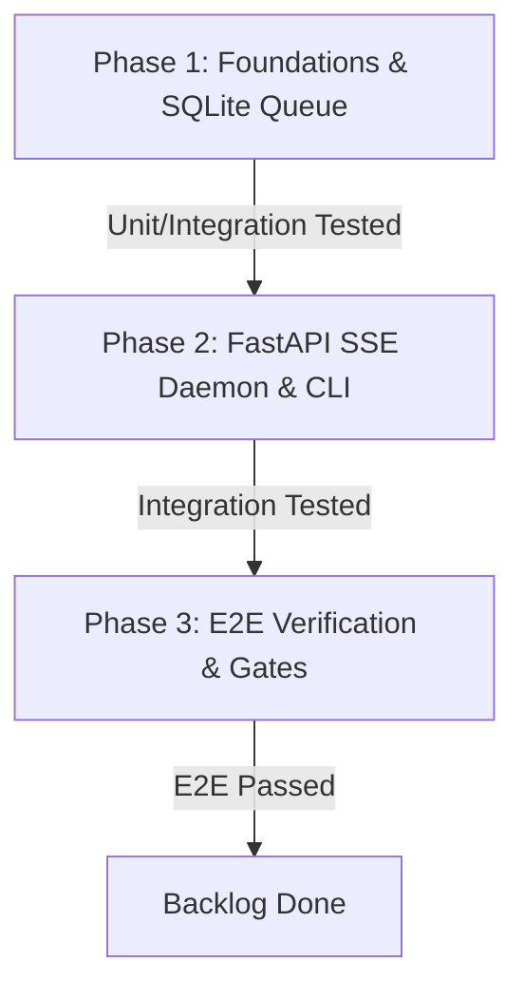

# Decoupled Daemon & Flow Worker Queue Plan

This plan defines the step-by-step implementation sequence to build the headless daemon (`gflow serve`), the SQLite-backed background worker queue (`FlowWorker`), and the E2E verification test suite.

---

## 1. Agreed Design Fundamentals & Best Practices

Before starting execution, we establish agreement on these core constraints and best practices:
1. **Decoupled Repositories:** Keep `gflow-cli` strictly headless. No visual frontend files (React, Vite, Node modules) should exist inside the `gflow-cli` codebase. The UI client runs as an independent sibling desktop app (e.g., Gflow Studio built with Tauri).
2. **SQLite WAL Mode:** Both the CLI daemon and the visual UI access `gflow.db` concurrently. Direct reads (SQL queries) happen inside the UI for sub-10ms performance, utilizing `PRAGMA journal_mode = WAL` and `PRAGMA busy_timeout = 5000` to prevent write locks.
3. **Single Writer Serialization:** Playwright session locks restrict browser profile operations to one OS process. The local daemon is the sole browser automation broker, serialization managed using an `asyncio.Lock` inside the background worker.
4. **Local network Isolation:** The FastAPI server listens on `127.0.0.1` by default. Binding to `0.0.0.0` is prohibited unless explicit API token headers (`GFLOW_DAEMON_TOKEN`) are active.
5. **Crash Recovery & Clean Exit:** The daemon wires OS signal handlers (`SIGINT`/`SIGTERM`) to release locks and closes browser instances cleanly. Upon daemon boot, a recovery SQL script clears active `processing` flags to prevent lock-ups.
6. **CLI/MCP Option Symmetry:** A CI test verifies that any CLI command parameter added in Click command routers is programmatically mirrored in FastMCP server tool registration signatures to prevent drift.

---

## 2. Phased Development Sequence

### Phase 1 — Foundations & SQLite Queue

**Goal:** Establish the database schema, SQLite transactional queries, queue worker loop, and verify sequential execution locks under unit/integration mocks.

*   **Task 1.1: Dependencies & Environment Settings**
    *   Add `fastapi`, `uvicorn`, and `sse-starlette` to `pyproject.toml` dependencies.
    *   Run `uv sync` to update lock files.
    *   Add `GFLOW_DAEMON_TOKEN` and `GFLOW_DAEMON_PORT` template properties in `.env.template` and [config.py](file:///C:/development/github/gflow-cli/src/gflow_cli/config.py).
    
*   **Task 1.2: Database Migration (`0002_queue.sql`)**
    *   Create migration file `src/gflow_cli/data/migrations/0002_queue.sql`.
    *   Create the `generation_queue` table tracking `task_id`, `profile_name`, `task_type` (t2i, t2v, etc.), `payload_json`, `status` (pending, processing, completed, failed), `flow_media_id`, `error_json`, `created_at`, and `updated_at`.
    
*   **Task 1.3: Queue Repository & FlowWorker Daemon**
    *   Create `src/gflow_cli/worker/queue.py` containing transaction-safe SQLite inserts, status transitions, and pending task polling.
    *   Create `src/gflow_cli/worker/daemon.py` containing the `FlowWorker` infinite poll loop.
    *   Ensure the queue worker enforces sequential execution locks using an `asyncio.Lock` per Chrome profile context to prevent Playwright conflicts.
    *   Ensure failures log RFC 9457 structured problems inside the database's `error_json` column.
    
*   **Task 1.4: Unit & Integration Mocks**
    *   Create `tests/worker/test_daemon.py`.
    *   Write tests verifying queue insertion, priority order polling, background execution under mocked client conditions, and database status state changes.

---

### Phase 2 — FastAPI SSE Daemon & CLI Integration

**Goal:** Wrap the FastMCP instance in FastAPI SSE routers, support OS shutdown signal traps, add database crash recoveries, and add the Click command `gflow serve`.

*   **Task 2.1: FastAPI SSE Application Architecture**
    *   Create `src/gflow_cli/ui/app.py`.
    *   Expose endpoints `GET /mcp/sse` (initiates server SSE transport stream) and `POST /mcp/message` (receives JSON-RPC command payloads).
    *   Redact raw secrets or session tokens in daemon logs using `redact_metadata`.
    
*   **Task 2.2: Crash Recovery & OS Signal Traps**
    *   Create `src/gflow_cli/ui/server.py` containing Uvicorn boot operations.
    *   Wire signal handlers for `SIGINT` (Ctrl+C) and `SIGTERM` in the FastAPI event loops to safely close Playwright browser processes and database cursors.
    *   On FastAPI startup, execute a database sweep to reset any hung `processing` tasks to `failed` with a recovery message.
    
*   **Task 2.3: Click CLI Command `gflow serve`**
    *   Modify `src/gflow_cli/cli.py` to add `gflow serve [--port PORT] [--host HOST] [--profile NAME]` command.
    *   Implement filesystem-level locks (`profile.lock`) inside browser manager sequences to block manual command runs while the daemon is actively running a browser context for that profile.
    
*   **Task 2.4: Integration Tests**
    *   Create `tests/ui/test_app.py`.
    *   Write integration tests verifying connection handshakes on `/mcp/sse`, JSON-RPC echo routing, and recovery behaviors.

---

### Phase 3 — E2E Verification & Symmetry Gates

**Goal:** Establish end-to-end integration tests using live credentials, verify CLI/MCP option parameters symmetry, update roadmaps, and pass all hygiene gates.

*   **Task 3.1: E2E Integration Suite (`tests/e2e/test_daemon_e2e.py`)**
    *   Write `tests/e2e/test_daemon_e2e.py`.
    *   **E2E Test Execution Sequence:**
        1. Spawn the daemon background process using `gflow serve --port 8999 --profile default`.
        2. Initiate an SSE client connection over `http://127.0.0.1:8999/mcp/sse`.
        3. Dispatch an MCP tool command `generate_image` containing test inputs.
        4. Read and assert on the incoming SSE stream events to verify log steps and status changes.
        5. Verify that the final asset is downloaded, a SQLite record exists in the database, and the local file is registered.
        6. Send termination signal, asserting that the daemon shuts down, releases files, and exits cleanly.
        
*   **Task 3.2: CLI & MCP Option Symmetry Validation**
    *   Update `tests/mcp/test_server.py` to programmatically extract Click CLI command inputs and verify that every option and default matches FastMCP schemas.
    *   Validate that missing schemas fail the CI test suite.
    
*   **Task 3.3: Repository Hygiene & Backlog Sync**
    *   Refine `ROADMAP.md` milestones.
    *   Update root `PLAN.md` backlog.
    *   Run `/gflow:check` (the Impeccable Routine) to verify all gates pass.

---

## 3. Definition of Done (DoD)

To resolve this feature branch as complete and ready for integration:
- [ ] All development tasks and phases checked off.
- [ ] All unit, integration, and E2E daemon tests pass cleanly.
- [ ] The CLI/MCP option symmetry test verifies parameter parity.
- [ ] The `gflow serve` command starts FastAPI/Uvicorn, binds safely to localhost, and shuts down cleanly on OS signals.
- [ ] `gflow.db` schema migration versions are verified transactional.
- [ ] Documentation and roadmaps are updated to reflect the new daemon architecture.
